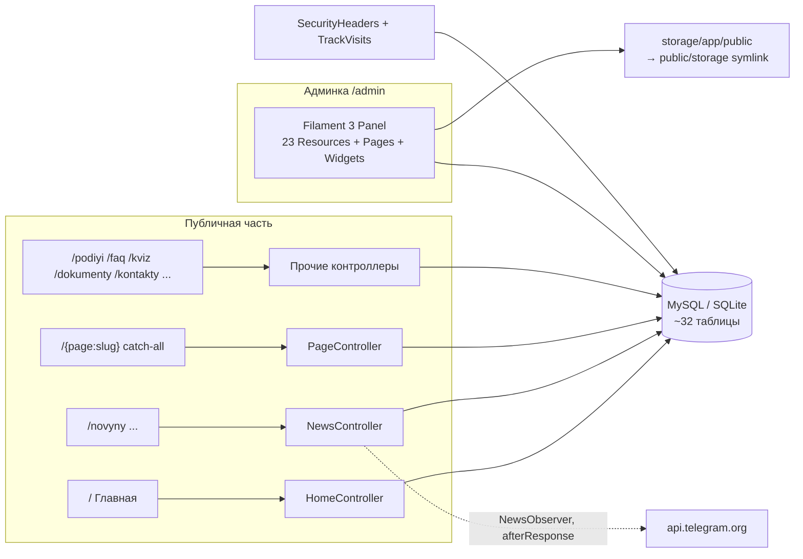

# Архитектура сайта ОТФК (otfk)

> Авторитетный справочник по проекту. Держится в синхронизации с кодом (правила — в [CLAUDE.md](CLAUDE.md)).
> HTML-версия: `ARCHITECTURE.html` — build-артефакт, генерируется командой `node DocsHtml/generate.mjs`, руками не редактируется.

## TL;DR

- **Что это:** новый сайт Одесского технического фахового колледжа ОНТУ (замена старого otfk.od.ua), пишется с нуля как **proof-of-concept**. Публичная часть + админка.
- **Стек (подтверждён по коду, НЕ «чистый PHP»):** PHP ^8.2 (CI/прод — 8.3), **Laravel 12**, **Filament 3** (вся админка), Blade + **Tailwind CSS v4** + **Alpine.js 3**, Vite 7. БД: SQLite в dev/тестах, **MySQL в проде**. Composer + npm.
- **Хостинг:** shared-хостинг ukraine.com.ua (SSH, без Node, без queue-воркера) — отсюда ключевые паттерны: фронтенд собирается в CI и заливается на сервер rsync-ом (деплой-workflow), фоновые задачи только через `dispatch(...)->afterResponse()`.
- **Локально:** `php artisan serve --port=8002` (см. `.claude/launch.json`), или `composer run dev`. Тесты: `composer test` (SQLite `:memory:`).
- **PoC-статус:** ролей нет (любой пользователь = полный админ), сид-данные фейковые, в футере бейдж «Альфа-версія». Полный список — в разделе [PoC-only](#poc-only).

## Структура репозитория

| Директория / файл | Что там |
|---|---|
| `app/Http/Controllers/` | Контроллеры публичной части (админка их не использует) |
| `app/Http/Middleware/` | `SecurityHeaders`, `TrackVisits` — оба глобально в `web`-группе |
| `app/Filament/` | Вся админка: Resources (23 шт.), Pages (`ContentChecklist`, `BellSchedule`, `BrokenLinks`, страницы настроек), Widgets |
| `app/Models/` | 28 Eloquent-моделей + трейт `Concerns/OptimizesUploadedImages` |
| `app/Services/` | `TelegramPoster` — исходящий постинг новостей в Telegram-канал |
| `app/Support/` | `ImageOptimizer` (GD → WebP), `BannerOverlay` (inline-CSS градиенты), `AdminPreview` (слепки форм для превью), `LinkChecker` (битые внутренние ссылки), `UniqueSlug` (слаг копии при «Дублювати») |
| `app/Jobs/`, `app/Mail/` | `PostNewsToTelegram` (писем больше нет — формы заявок/обращений удалены) |
| `app/Observers/` | `NewsObserver` — триггер Telegram-автопоста (подключён атрибутом на модели!) |
| `app/Console/Commands/` | `otfk:backup`, `images:webp`, `otfk:check-links` (битые внутренние ссылки в контенте, тот же движок — страница «Биті посилання» в админке) и пять импорт-команд контента старого сайта: `otfk:import-news`, `otfk:import-docs`, `otfk:import-pages`, `otfk:import-staff`, `otfk:import-contacts` (см. «Импорт контента старого сайта»); общий трейт чтения зеркала — `Concerns/ReadsOtfkExport` |
| `bootstrap/app.php` | Регистрация роутов, health `/up`, кастомные middleware |
| `config/` | Сток Laravel 12, кроме `blade-icons.php` (отключён дефолтный `<x-icon>`) |
| `database/migrations/` | Схема **и контент-фикстуры** (см. «Миграции как контент») |
| `database/content/` | HTML-тела страниц для контент-миграций (сняты со старого otfk.od.ua): `digital-publications/*.html` |
| `database/seeders/` | `DatabaseSeeder` (админ), `SiteSeeder` (демо-данные, деструктивен!), `QuizSeeder` |
| `routes/web.php` | Единственный файл роутов (API/webhook-роутов нет) |
| `routes/console.php` | Расписание: бэкап БД и prune визитов (еженедельно, UTC) |
| `resources/views/` | Blade: единый layout `components/layouts/app.blade.php` + страницы |
| `resources/css/app.css`, `resources/js/app.js` | Tailwind v4 тема + Alpine; весь кастомный JS — inline в layout |
| `public/build/` | Прод-бандл Vite; **в git не входит** — собирается локально (`npm run build`) и в CI при деплое |
| `tests/Feature/` | 44 фиче-теста; многие фиксируют поведенческие контракты |
| `docs/posibnyk-administratora.html` | Ручной (не генерируемый) мануал админа для персонала |
| `DocsHtml/generate.mjs` | Генератор HTML-твинов этой документации |
| `.github/workflows/` | `tests.yml` (тесты + сборка фронта) и `deploy.yml` (автодеплой `master` на хостинг) |
| `DEPLOY.md`, `README.md` | Деплой на ukraine.com.ua; обзор фич |

## Карта: страницы → обработчики → хранилище

## Маршруты

Глобальные middleware на всё (включая `/admin`): `web` + `SecurityHeaders` + `TrackVisits` (см. `bootstrap/app.php`).

### Публичные (`routes/web.php`)

| Метод | Путь | Имя | Обработчик | Что делает | PoC-only |
|---|---|---|---|---|---|
| GET | `/` | home | `HomeController@index` | Баннеры, тайлы, статистика, события, новости, видео, «В этот день» | нет |
| GET | `/novyny` | news.index | `NewsController@index` | Список новостей, пагинация 9, фильтры `?category=`, `?year=` | нет |
| GET | `/novyny/feed.xml` | news.feed | `NewsFeedController` | RSS 30 последних, `max-age=1800` | нет |
| GET | `/novyny/{news:slug}` | news.show | `NewsController@show` | Статья; +1 просмотр раз в сессию (только опубликованных). Неопубликованную видит залогиненный админ — превью с плашкой «Чернетка», без накрутки просмотров | нет |
| POST | `/novyny/{slug}/vpodobayka` | news.like | `NewsController@like` | Лайк-тоггл (JSON), fingerprint = sha1(ip+UA), `throttle:30,1` | нет |
| GET | `/video` | video.index | `VideoController@index` | Видео, пагинация 12; на 1-й странице — featured-ролик, плеер открывается в лайтбоксе (youtube-nocookie) | нет |
| GET | `/rozklad-dzvinkiv` | bells | `BellScheduleController@index` | Расписание звонков: карточка на каждую смену + live-подсветка текущей пары | нет |
| GET | `/podiyi` | events | `EventController@index` | Предстоящие + 6 прошедших событий | нет |
| GET | `/podiyi/{event}/ics` | events.ics | `EventController@ics` | Скачивание .ics | нет |
| GET | `/faq` | faq | `FaqController@index` | FAQ + JSON-LD | нет |
| GET | `/kviz` | quiz | `QuizController@index` | Профориентационный квиз: вопросы и варианты рендерит сервер (`data-step`/`data-opt`), **скоринг целиком в клиентском Alpine** | **да** (PoC-форма) |
| GET | `/dokumenty`, `/dokumenty/{cat:slug}` | documents.* | `DocumentController` | Публичная информация: список разделов с клиентским фильтром (Alpine); страница категории — пагинация 20/стр., поиск `?q=` (фильтрация в PHP через `mb_stripos` — SQLite не видит регистра кириллицы в `LIKE`), метаданные файла из акцессоров `Document::file_extension` / `file_size_label` | нет |
| GET | `/spetsialnosti`, `/spetsialnosti/{slug}` | specialties.* | `SpecialtyController` | Специальности + программы | нет |
| GET | `/struktura`, `/struktura/{slug}` | structure.* | `StructureController` | Отделения/комиссии + персонал | нет |
| GET | `/administratsiya` | staff.administration | `StaffController@administration` | Администрация: директор отдельным блоком, остальные — группами «Заступники директора» / «Керівники відділень та служб» (роль выводится из `position` акцессором `Staff::administration_role`), контакты приёмной из `settings` | нет |
| GET | `/personal/{staff:slug}` | staff.show | `StaffController@show` | Персональная страница работника: факты из `bio`, ссылки на CMS-страницы «проф. деятельность»/«повышение квалификации», коллеги по подразделению | нет |
| GET | `/halereya`, `/halereya/{slug}` | galleries.* | `GalleryController` | Галереи: список с пагинацией (12/стр.) и рекомендованным альбомом; альбом — мозаичная сетка + лайтбокс с перелистыванием, блок «Інші альбоми»; архивный (сепия) режим | нет |
| GET | `/poshuk`, `/poshuk/pidkazky` | search.* | `SearchController` | поиск по названиям (5 типов, фильтр `?type=`, пагинация 12/стр.) + JSON-подсказки (`throttle:60,1`) | нет |
| GET | `/kontakty` | contacts | `ContactController@index` | Контакты (карточки из `settings`, карта, соцсети); формы обратной связи нет — на otfk.od.ua её тоже нет | нет |
| GET | `/admin-preview/{token}` | admin.preview | `AdminPreviewController@show` | Превью несохранённой формы страницы/новости из админки (кнопка «Превʼю»): слепок состояния формы в кэше на 10 мин (`App\Support\AdminPreview`), рендер публичного шаблона без записи в БД, плашка «Попередній перегляд». Только залогиненным, иначе 404; путь добавлен в регексп исключений catch-all | нет |
| GET | `/sitemap.xml`, `/robots.txt` | sitemap, robots | `SitemapController` / closure | Sitemap (без кэша!), robots | нет |
| GET | `/up` | — | Laravel health | Health-check | нет |
| GET | `/{page:slug}` | pages.show | `PageController@show` | **Catch-all** CMS-страницы из БД. Обязан быть последним. Неопубликованную страницу видит залогиненный админ — превью с плашкой «Чернетка» (`components/draft-notice.blade.php`), гостям — 404. Шаблон один (`pages/show.blade.php`), но три варианта вёрстки: хаб с дочерними страницами (`partials/hub`; короткий `body` ≤800 знаков — в сайдбаре «Про розділ», длинный — статьёй в основной колонке под карточками), обычная контентная страница с липким сайдбаром и навигацией по заголовкам (`partials/content`), heritage-«письмо» (`partials/neighbours` под ним) | нет |

### Админка

Ручных админ-роутов **нет** — всё генерирует Filament (`app/Providers/Filament/AdminPanelProvider.php`): путь `/admin`, login/logout/profile встроенные, **регистрация и сброс пароля отключены**. Auto-discovery ресурсов из `app/Filament/Resources` (Banner, Department, Document(+Category), Event, Faq, Gallery, MenuItem, News(+Category), Page, Program, QuickLink, QuizQuestion, Setting, Specialty, Staff, StatItem, User, Video), страницы `ContentChecklist` («Що ще наповнити»; страницы-плитки перехватываемых роутов — `rozklad-dzvinkiv`, `faq`, `kviz` — и хабы с опубликованными детьми не считаются заглушками), `BellSchedule` («Розклад дзвінків» — форма настроек вместо CRUD) и `BrokenLinks` («Биті посилання» — отчёт `App\Support\LinkChecker` с кэшем 10 мин и кнопкой перепроверки), виджеты дашборда (QuickActions, Drafts — «Чернетки», скрыт при их отсутствии, StatsOverview, VisitsChart, TopNews, TopPages).

Группа «Налаштування» (Этап 2 [ADMIN-UX-PLAN.md](ADMIN-UX-PLAN.md)) — четыре «человеческие» страницы-формы поверх таблицы `settings` (общая база `app/Filament/Support/SettingsFormPage.php`: страница объявляет `keys()`, mount читает `Setting::map()`, save пишет `firstOrNew`+`save`, кэш скидывает обсервер модели): «Контакти та соцмережі» (`contact_*`, `work_hours`, `map_embed`, `social_*`), «Оголошення» (`announcement_*` + живой предпросмотр полосы), «Telegram» (`telegram_autopost`/`telegram_bot_token` — поле-пароль/`telegram_channel` + кнопка «Надіслати тестове повідомлення» — `TelegramPoster::sendTest()` с незохранённых значений формы), «Підвал і вигляд» (`footer_about`, `site_version_label/color`; затемнение баннеров осталось только в «Банери»). Сырой key-value `SettingResource` переименован в «Розширені налаштування» и опущен в низ группы как аварийный доступ. Тест: `SettingsPagesTest`.

Во всех ресурсах есть действие «Переглянути на сайті» (общий хелпер `app/Filament/Support/ViewOnSite.php`): открывает публичную страницу записи (страницы, новости, специальности, подразделения, персонал, галереи, категории документов) или соответствующий раздел сайта (события, FAQ, видео, баннеры, статистика, квиз, меню, быстрые ссылки, расписание звонков) в новой вкладке — и как кнопка в шапке Edit-страницы, и как действие строки таблицы. Для страниц и новостей кнопка работает и для черновиков: залогиненный админ видит неопубликованный контент с плашкой «Чернетка» (тест `DraftPreviewTest`).

Кроме того, на формах создания/редактирования страниц и новостей есть кнопка «Превʼю» (`app/Filament/Support/PreviewFormAction.php`) — превью *несохранённых* изменений в стиле GitHub wiki: текущее состояние формы кладётся слепком в кэш (`App\Support\AdminPreview`, TTL 10 мин), и `/admin-preview/{token}` открывается в новой вкладке с настоящим публичным шаблоном и плашкой «Попередній перегляд» — без записи в БД. Нескалярные поля (загрузка файлов) в слепок не попадают — для них показывается сохранённое значение. Тест: `FormPreviewTest`.

UX-мелочи таблиц и форм (Этап 1 плана [ADMIN-UX-PLAN.md](ADMIN-UX-PLAN.md)): перетаскивание порядка (`->reorderable('sort_order')`) в MenuItem (с группировкой по родителю), QuickLink, Faq, StatItem, DocumentCategory, Specialty, Department, Staff; инлайн-тумблеры публикации (`ToggleColumn`) в таблицах Page, Document, Gallery, Staff и MenuItem (`is_visible`) — **у новостей тумблера в таблице сознательно нет**: `NewsObserver` шлёт автопост в Telegram при «оживлении» новости, переключение только в форме (закреплено тестом `AdminTablesTest`); превью итогового URL префиксом у полей slug; фильтры таблиц (страницы — по разделу и черновикам, новости — по категории/году/черновикам, документы — по категории, персонал — по подразделению и категории); осмысленные пустые состояния (`emptyStateHeading/Description`) во всех контентных ресурсах. Смоук-тест рендера всех List-страниц: `AdminTablesTest`.

Удобство редактирования контента (Этап 3 плана [ADMIN-UX-PLAN.md](ADMIN-UX-PLAN.md)): у `RichEditor` страниц и новостей включена загрузка изображений прямо в текст (attachments, диск `public`, каталоги `pages`/`news`); действие «Дублювати» в таблицах страниц и новостей — копия-черновик с заголовком «… (копія)» и слагом `-kopiya[-N]` (`App\Support\UniqueSlug`), у новостей обнуляются `views`/`likes`/`telegram_posted_at` (автопост в Telegram не срабатывает — копия не опубликована), после дублирования — редирект в редактирование копии; проверка битых внутренних ссылок — `App\Support\LinkChecker` (сканирует href/src в телах страниц и новостей: несуществующие страницы/разделы, черновики, отсутствующие файлы `storage`, ссылки на старый otfk.od.ua; внешние сайты не проверяет) с двумя интерфейсами: artisan `otfk:check-links` (exit 1, если нашёл) и страница админки «Биті посилання»; виджет «Чернетки» на дашборде — неопубликованные страницы/новости одним списком со ссылками «Редагувати» и «Перегляд» (превью черновика на сайте, см. `DraftPreviewTest`). Тест: `AdminEditingToolsTest`.

### API / webhooks

Отсутствуют. `routes/api.php` нет; Telegram — только исходящий. JSON отдают лишь `news.like` и `search.suggest` (обычные web-роуты с CSRF/сессией).

## Авторизация и роли

- Вход: встроенный Filament Login по `/admin/login`. Учётки — таблица `users`, пароль bcrypt (`'password' => 'hashed'`).
- Сессии: драйвер `database` (таблица `sessions`); `AuthenticateSession` в панели.
- **Ролей нет вообще.** `User::canAccessPanel()` возвращает `true` — каждая запись в `users` = полный админ на все ресурсы, включая `UserResource`. Это задокументировано в докблоке как осознанное PoC-решение. Gates/Policies отсутствуют.
- Первый админ создаётся `DatabaseSeeder`: `env('ADMIN_EMAIL', 'admin@otfk.od.ua')` / `env('ADMIN_PASSWORD', 'password')` — **дефолт-фоллбек `password` в публичном репо** (см. PoC-only).

## Схема данных

Прод — MySQL, dev — SQLite-файл (`database/database.sqlite`, в git не входит), тесты — SQLite `:memory:`. Загрузки — диск `public` (`storage/app/public` → симлинк `public/storage`); URL строятся как `asset('storage/...')`.

Доменные таблицы (полный DDL — в `database/migrations/`):

| Таблица | Назначение / ключевые колонки |
|---|---|
| `pages` | CMS-дерево (parent_id, slug unique, body longText, section, is_published, is_heritage, is_featured, meta_*). `is_featured` — «ключевая страница раздела»: на родительской странице-хабе выносится наверх отдельной карточкой (миграция `2026_08_28_170000`, тумблер в Filament) |
| `news`, `news_categories`, `news_likes` | Новости: category_id, published_at, is_featured, is_heritage, views, likes, telegram_posted_at; лайки — unique(news_id, fingerprint). `news.is_featured` публичным сайтом не используется (главная карточка ленты — просто первая новость); тумблер в админке помечен как «на майбутнє» |
| `menu_items` | Дерево навигации: link_type page/url/route, page_id, is_visible; кэш `menu.navigation` 600с |
| `settings` | Key-value (key unique, group, type — тип виджета в Filament); кэш `settings.map` 600с. Основные ключи редактируются страницами-формами группы «Налаштування» в админке (см. «Админка»), сырой CRUD — «Розширені налаштування». Соцсети: `social_facebook`, `social_instagram` (шапка + футер), `social_youtube` (блок-призыв на `/video`; пустое значение — блок скрыт). `bells_second_shift` — показывать ли вторую смену на `/rozklad-dzvinkiv`, `bells_now_chip` — показывать ли плашку «зараз іде пара» в верхней полосе layout (оба тумблера — на странице «Розклад дзвінків»). `footer_about` — текст «Про коледж» в подвале (гарантируется миграцией `seed_footer_partner_links_and_setting`) |
| `quick_links` | Ссылки-«плитки»: location `home_tile` (4 плитки главной) и `footer_partner` (блок «Партнери» в подвале; при пустой таблице — фолбек ОНТУ/МОН в `app.blade.php`). Официальные ссылки подвала оригинального сайта (ОНТУ, МОН, НМЦ ВФПО, Органічна платформа знань, УКЦ 1545) заводит миграция `2026_08_28_183000_seed_footer_partner_links_and_setting` (`firstOrCreate` — ручные правки не перетирает) |
| `banners` | Слайдер главной: image, image_alt, окно дат starts_at/ends_at |
| `documents`, `document_categories` | Публичная информация: file_path или external_url (external — приоритет) |
| `specialties`, `programs` | Специальности (slug, code — только новые буквенные F2/F7/G13/D2…) + файлы программ; реальные описания и ОПП завозит миграция `import_specialties_content`, демо-остатки сидера (071 «Облік і оподаткування», описания «Сучасна підготовка…») убирает `remove_demo_specialty_and_fix_descriptions` |
| `departments`, `staff` | Структура (type: viddilennya/tsyklova-komisiya/kafedra) и персонал (category: administration/teacher); `staff.slug` — unique, автогенерация из ПИБ в `Staff::booted()`, адрес персональной страницы |
| `galleries`, `photos` | Фотоальбомы; `is_archive` → сепия-режим |
| `videos` | YouTube-ролики (youtube_id → accessors `thumbnail`, `watch_url`, `embed_url`, `private_embed_url` — youtube-nocookie для лайтбокса) |
| `events` | События; **starts_at хранится как киевское wall-clock время**, UTC — через `utcStart()/utcEnd()` |
| `bell_periods` | Расписание звонков: `shift` (1/2) + `number` (номер пары внутри смены), `starts`/`ends`, `is_active`; кэш `bell_periods.v2` 600с. Ровно 8 строк — по 4 пары на смену (`BellPeriod::PAIRS_PER_SHIFT`), админка их не создаёт и не удаляет, только правит времена (`updateOrCreate`). Вторая смена целиком скрывается настройкой `bells_second_shift` (`0`/`1`) — фильтрация после кэша, строки в БД остаются |
| `stat_items`, `faqs` | Блоки главной («Коледж у цифрах») и страница FAQ |
| `quiz_questions`, `quiz_options` | Квиз: options с points и specialty_id |
| `site_visits` | Аналитика без кук: unique(date, path), без timestamps; спец-путь `_visits` для уникальных визитов; prune > 180 дней |
| users, sessions, cache, jobs... | Стоковые таблицы Laravel |

### Миграции как контент-фикстуры

Ключевой паттерн проекта: реальные тексты старого сайта и структура меню — **версионируемые фикстуры внутри миграций** (`seed_*`, `import_*`), чтобы попадать на прод через `migrate --force` без `db:seed`. Почти все идемпотентны (`firstOrCreate`), `down()` намеренно не удаляет контент. Последствия и ловушки — в [Gotchas](#gotchas).

### Сидеры

- `DatabaseSeeder` — админ (env или дефолт) → `SiteSeeder` → `QuizSeeder`.
- `SiteSeeder` — **демо-данные и деструктивен при повторном запуске**: делает `delete()` по `menu_items`, `staff`, `videos`, `banners` и документам сидируемых категорий. Исключение — специальности: их сидер создаёт только при отсутствии записи и не перетирает контент миграции `import_specialties_content` (демо-программу добавляет лишь специальности без единой ОПП). Никогда не запускать `db:seed` на живом проде с реальным контентом.
- `QuizSeeder` — 6 вопросов × 4 варианта, привязка к специальностям по `code`; идемпотентен; также вызывается изнутри миграции `2026_06_12_100000_create_quiz_tables`.

## Импорт контента старого сайта (otfk:import-*)

Шесть artisan-команд переносят контент старого otfk.od.ua (пять import-* и link-opp-programs). Все умеют читать **локальное зеркало** (каталог аудита `site-audit/YYYY-MM-DD/` с `content-export/*.md`, `content-export/files|images/`, `_raw/html/`, `links-map.csv`; сам каталог в `.gitignore`) через опцию `--from-export=<путь>` — повторный скрейпинг живого сайта не нужен. У `otfk:import-news` и `otfk:import-docs` осталась и историческая HTTP-ветка (без опции — ходят на живой сайт).

| Команда | Что делает | Идемпотентность |
|---|---|---|
| `otfk:import-news` | Новости (`content-export/news/*.md`) → `News`; фото копируются в `storage/news/imported/`, первое — обложка; `telegram_posted_at` ставится сразу (без автопоста). Опции: `--dry-run`, `--limit`, `--fresh` | маркер `<!--imported-from:URL-->` в body |
| `otfk:import-docs` | PDF по мапам `$docMap` (19 разделов → категории документов: 18 из `public_information/*` + `applicant/educational_and_professional_programs` → категория `osvitno-profesiyni-prohramy`, ~60 PDF ОПП/учебных планов) и `$pageMap` (23 страницы) из сохранённого HTML `_raw/html/`; файлы → `storage/documents/…`, `storage/page-files/…`. Опции: `--dry-run`, `--audit`, `--fresh` | дедуп по названию внутри категории; блок `<!--imported-files-->` на страницах |
| `otfk:import-pages` | Тексты всех содержательных страниц (~203) → CMS `Page`: известные страницы обновляются по мапе «старый путь → slug», новые создаются с транслит-slug и `parent_id` по разделам; картинки/PDF копируются в `storage/imported/{images,files}/<старый путь>`, внутренние ссылки переписываются. Пропускает: новости, `public_information/*`, страницы комиссий/кафедр (их ведёт import-staff), сервисные | маркер `<!--imported-from:URL-->`; повторный запуск обновляет на месте. Артефакты ранних прогонов (дубли `information-about-college-2`, `akademicna-dobrocesnist`, `administraciia`; кривые названия/слаги каталогов «Цифрові видання у галузях» из `digital_publications_in_industries/*`) чинит data-миграция `2026_08_29_090000_cleanup_imported_pages_…` — тела берёт из `database/content/digital-publications/*.html`, маркеры сохраняет |
| `otfk:import-staff` | `structure/*` → `Department` (4 відділення, 7 циклових комісій, 3 кафедри) + `Staff` из таблиц «Викладацький склад» и `about_us/leaders_of_the_college.md` (администрация). Ссылки на персональные страницы преподавателей резолвятся в CMS-страницы import-pages → **запускать после `otfk:import-pages`**. Опция `--replace-demo` удаляет только фейковые записи SiteSeeder | `updateOrCreate` по slug / full_name |
| `otfk:link-opp-programs` | Підв'язує PDF з категорії документів `osvitno-prohramy` (slug `osvitno-profesiyni-prohramy`) до записів `Program` за назвою ОПП (нормалізація апострофів/дефісів, перевага файлам з новим літерним кодом). Потрібна, коли `otfk:import-docs` запускається ПІСЛЯ міграції `import_specialties_content` (типовий випадок на сервері). Опція `--force` — перепривʼязати всі | пропускає програми, де файл уже є |
| `otfk:import-contacts` | `content-export/contacts.md` → settings: `contact_address/phone/email`, `feedback_email` (ключ legacy — приложением больше не используется), `map_embed` + `Cache::forget('settings.map')`; дополнительные телефоны печатает в консоль | `updateOrCreate` по key |

Рекомендуемый порядок полного прогона: `import-docs` → `import-pages` → `import-staff` → `import-news` → `import-contacts`. Ограничения зеркала: 233 iframe-PDF старого сайта — мёртвые (404 и на самом старом сайте; живые 34 дозобраны в зеркало 2026-08-28) — их ссылки/iframe остаются битыми на ~18 импортированных страницах, решение за редакцией (см. SYNC-PLAN.md в каталоге зеркала); у человека одна запись `Staff` (повторы одного преподавателя в нескольких подразделениях схлопываются — последний импортированный побеждает). Тесты — `tests/Feature/ImportFromExportCommandsTest.php` (фикстура-минизеркало `tests/fixtures/otfk-export/`).

## Фоновая работа без очереди

На хостинге нет queue-воркера, поэтому **всё «фоновое» — `dispatch(...)->afterResponse()`** (выполняется в умирающем PHP-запросе): Telegram-пост, WebP-конверсия загрузок. **Не переводить на `ShouldQueue`** — задокументированный запрет (DEPLOY.md).

Telegram-автопост: `NewsObserver` (подключён PHP-атрибутом `#[ObservedBy]` на модели `News`, НЕ в провайдере) атомарно ставит `telegram_posted_at` (`whereNull->update`) и диспатчит `PostNewsToTelegram`. Включается тремя настройками из БД: `telegram_autopost === '1'`, `telegram_bot_token`, `telegram_channel`.

## CI / деплой

### `.github/workflows/tests.yml` — CI («Тести»)

Триггер: каждый `push` и `pull_request` (без фильтров). Секретов не использует.

- **Job `tests`** (ubuntu, PHP 8.3): checkout → setup-php (pdo_sqlite, gd, intl...) → composer-кэш → `composer install` → `composer audit` (advisory, `continue-on-error`) → `cp .env.example .env` + `key:generate` → `php artisan test`. Заметь: тесты на SQLite, прод на MySQL — MySQL-специфика CI не ловится.
- **Job `assets`** (ubuntu, Node 20): `npm ci` → `npm run build` — smoke-проверка, что фронтенд собирается.

### `.github/workflows/deploy.yml` — CD («Deploy to production»)

Триггер: push в `master` **или в `feature/**`** (осознанное решение для прототипа: прод-окружение одно, сервер встаёт на запушенную ветку, её миграции едут в живую БД; вернуть сайт на master = запушить/задеплоить master), либо ручной `workflow_dispatch`; `concurrency: deploy-production` (без отмены запущенного). Шаги: сборка фронта в CI (Node 22, `npm ci && npm run build`) → SSH на хостинг (`git fetch` + `git reset --hard origin/master`, `composer install --no-dev`) → rsync `public/build/` на сервер (`--delete`) → `migrate --force` + `optimize:clear` + `config:cache`/`route:cache`/`view:cache`. Репозиторий публичный, поэтому сервер тянет код по https без deploy key. Секреты: `REMOTE_KEY` (приватный SSH-ключ), `REMOTE_HOST`, `REMOTE_USER`, `REMOTE_PATH`, опционально `REMOTE_PORT` (дефолт 22).

### Фронтенд-бандл

`public/build/` **не коммитится** (в `.gitignore`): его собирает деплой-workflow и заливает rsync-ом. Локально — `npm run build`/`npm run dev`. (Ранее бандл коммитился в git, а `scripts/frontend-source-hash.mjs` следил за его свежестью — механизм удалён вместе с переходом на CD.)

### Первичный деплой (DEPLOY.md, хостинг ukraine.com.ua «Кращий»)

Вариант A: `git clone` → `composer install --no-dev` → `.env` из `.env.production.example` → `migrate --seed --force` (**обязательно до** `artisan optimize` — кэш конфига ломает env-чтение в сидере) → `filament:assets` → `storage:link` → `optimize` → document root на `public/`; `public/build` при первом деплое залить вручную. Вариант B: zip с локально собранными `vendor/` и `public/build/`. Cron: `* * * * * php artisan schedule:run` (расписание: `otfk:backup` вс 03:30 UTC, prune `site_visits` вс 04:00 UTC).

## Gotchas

1. **Таймзона.** `config/app.php` хардкодит `'timezone' => 'UTC'` и НЕ читает `APP_TIMEZONE` (переменная в `.env.production.example` — мёртвая). Даты хранятся как киевское wall-clock и «дошифтовываются» вручную `shiftTimezone('Europe/Kyiv')` в 5 местах (`Event::utcStart/utcEnd`, `news/show`, `feed/news`, `events/index`). Расписание cron — в UTC (03:30 UTC = 06:30 Киев летом).
2. **Catch-all `/{page:slug}`** в конце `routes/web.php` с хардкод-регекспом исключений (`admin|livewire|novyny|...`). Любой новый top-level роут надо добавить в этот регексп, иначе его перехватит `PageController`.
3. **`NewsObserver` подключён атрибутом на модели** — `AppServiceProvider` пуст; Telegram-сайд-эффект легко не заметить при правках `News`.
4. **`telegram_posted_at` ставится ДО успеха HTTP-вызова**: при сбое Telegram новость навсегда помечена отправленной, только `Log::warning`. Ретрай — вручную обнулить поле.
5. **Fresh-install ловушка:** контент-миграции `seed_abituriyentu_sections` / `seed_studentu_sections` / `import_*` тихо no-op, если страницы/меню ещё не созданы `SiteSeeder`-ом, и повторно не выполняются (уже отмечены как прогнанные). Правильный порядок нового окружения: `migrate` → `db:seed` даёт полный результат только потому, что сидер строит дерево сам; вникай перед изменением этого порядка.
6. **`SiteSeeder` деструктивен** (delete меню/персонала/видео/баннеров) — только для пустых окружений.
7. **Миграции используют Eloquent-модели** (`Page`, `MenuItem`, `DocumentCategory`, вызов `QuizSeeder`) — переименование модели/фила ломает `migrate` с нуля. Меню-миграции ищут корни по украинским label-строкам («Абітурієнту» и т.п.) — переименование пункта меню в админке ломает их идемпотентность.
8. **Dynamic Tailwind-классы из БД:** `home.blade.php` строит `bg-{{ $tile->color }}-50`; работает только благодаря safelist `@source inline(...)` в `app.css` (brand/gold). Другой цвет тайла молча отрендерится без стилей.
9. **Хардкод-слаги в шаблонах:** `url('/abituriyentu')` в 7 местах указывает на CMS-страницу из БД (удаление/переименование = 404 главного CTA); drop cap завязан на slug `istoriya` (`pages/partials/content.blade.php` и heritage-ветка `pages/show.blade.php`), закреплено тестом `HeritageProseTest`. Тот же слаг ищет `NewsController::abiturientLinks()` (сайдбар «Корисно для абітурієнта» на детальной новости) — не найдёт пункт меню, блок молча не рендерится.
10. **Светлая тема — контракт.** Ночной режим удалён намеренно; `FrontendPolishTest::test_site_is_light_only_without_theme_toggle` следит, чтобы toggle/`localStorage theme` не вернулись. Настройка `night_opacity` удалена миграцией; остался только `banner_overlay_opacity` (затемнение баннеров, `App\Support\BannerOverlay`).
11. **«Лампа» / Tier / Polish** в именах миграций и тестов — внутренние кодовые имена этапов сдачи, не фичи. `LampaTwo` = флаги `is_heritage`/`is_archive`.
12. **Layout ходит в БД:** `app.blade.php` дергает `MenuItem::navigation()`, `Setting::map()`, `QuickLink`, `BellPeriod::active()` на каждой странице (частично кэшировано на 600с). Миграции, пишущие в `settings` напрямую, обязаны делать `Cache::forget('settings.map')`.
13. **Неэкранированный HTML:** `{!! $news->body !!}`, `{!! $page->body !!}`, `map_embed` → iframe. Контент админский, но санитизации нет.
14. **Sitemap без кэша** — 5 полных `->get()` по таблицам на каждый запрос; деградирует с ростом архива новостей (импортирован с 2014).
15. **Импорт-команды `otfk:import-news|docs` без `--from-export` ходят на живой legacy-сайт** otfk.od.ua; `--fresh` удаляет ранее импортированное. Предпочтительный режим — `--from-export=<site-audit/…>` (локальное зеркало, см. «Импорт контента старого сайта»). Не запускать бездумно.
16. **`FILESYSTEM_DISK=local`** в env, но все загрузки/URL рассчитаны на диск `public` (Filament по умолчанию грузит в `public`). Код, использующий default-диск, запишет в недоступное место.
17. **Тесты ловят контракты** — перед правкой поведения читай соответствующий Feature-тест (excerpt-дедупликация, heritage-типографика, чеклист контента, light-only и т.д.).
18. **`SecurityHeaders` намеренно без CSP** (инлайн-скрипты Livewire/Alpine/Filament); `SESSION_SECURE_COOKIE` в прод-шаблоне не задан.
19. **DEPLOY.md** — смесь русского и украинского языка; описывает первичный ручной деплой, обновления едут автодеплоем (`deploy.yml`).
20. **Расписание звонков — две смены.** Смены накладываются (4-я пара 1-й смены 12:50–14:00 идёт одновременно с 1-й парой 2-й смены 13:00–14:10), поэтому `bellState()` в `app.blade.php` возвращает МАССИВ текущих пар (ключ `«смена:номер»`), а не одно число. Номер пары уникален только внутри смены. Миграция `2026_08_28_150000` переписала дефолтные времена на реальные, но только если их ещё не правили в админке (guard по точному совпадению со старым набором). Кэш-ключ сменился на `bell_periods.v2` — старый `bell_periods` на проде не содержит колонку `shift`. Золотой цвет на странице означает ровно «идёт прямо сейчас»: длинная перемена статически серая, золотой фон ей даёт только `isGapNow()` (ключ перерывы — пара, ПОСЛЕ которой она идёт). После последней пары `bellState()` отдаёт `status: 'Пари на сьогодні завершено'`, в воскресенье — `'Неділя — вихідний'`; в оба случая `short` пустой, чтобы плашка в шапке молчала. Количество пар фиксировано (4 + 4): админка — не CRUD, а страница-форма `App\Filament\Pages\BellSchedule` (8 пар времён + тумблеры `bells_second_shift` и `bells_now_chip`); ресурса `BellPeriodResource` больше нет. Плашка в шапке рендерится только при `BellPeriod::chipEnabled()`.
21. **`LIKE` не видит регистра кириллицы в SQLite.** Dev/тесты идут на SQLite, где `LIKE` (и `LOWER()`) регистронезависимы только для ASCII: `?q=положення` не найдёт «Положення …», хотя на проде (MySQL, `utf8mb4_unicode_ci`) найдёт. Поэтому и поиск по документам внутри категории (`DocumentController@category`), и общий поиск `/poshuk` вместе с подсказками (`SearchController::collectResults()`) фильтруют коллекцию в PHP через `mb_stripos`: выборки маленькие (≈900 строк, только нужные колонки), зато результат одинаков на SQLite и MySQL.
23. **Страницы `errors/500.blade.php` и `errors/503.blade.php` — автономные.** Никакого layout, Blade-компонентов, `route()` и собранного бандла: они рендерятся, когда приложение сломано или стоит `artisan down`, поэтому всё оформление — инлайновый CSS в фирменных цветах. `404` и `403`, наоборот, идут через `x-layouts.app` (на 404 живёт живой поиск и блок разделов из DB-меню). Контракт сторожит `ErrorPagesTest`.
22. **`docs/posibnyk-administratora.html`** — ручной, без генератора, шрифты с внешнего CDN; дрейфует от админки при изменении фич. Актуализирован до v1.1 (серпень 2026) под этапы 0–3 ADMIN-UX-PLAN; при новых фичах админки обновлять руками.

## PoC-only (удалить/заменить перед продом)

Консолидированный список. Новые временные элементы добавлять сюда же (правило в [CLAUDE.md](CLAUDE.md)).

| # | Что | Где | Действие перед продом |
|---|---|---|---|
| 1 | Дефолт-креды админа `admin@otfk.od.ua` / `password` | `database/seeders/DatabaseSeeder.php` | Убрать фоллбек; требовать env. DEPLOY.md даже предлагает логиниться этими кредами — поправить |
| 2 | Нет ролей: каждый user — полный админ | `app/Models/User.php` `canAccessPanel()` | Ввести роли/политики или хотя бы ограничить `UserResource` |
| 3 | Бейдж «Альфа-версія» в футере | настройки `site_version_label/color` (сид в `2026_06_10_150000`) | Очистить label (пустой = скрыт) |
| 4 | Ссылка «Адмінпанель» в публичной шапке | `components/layouts/app.blade.php` — utility bar (десктоп) и подвал off-canvas меню (мобильный) | Убрать в обоих местах |
| 5 | Фейковый персонал (8 выдуманных людей), фейковые документы «документ №N», демо-программы, демо-новости, демо-баннеры «Вступ 2026» | `database/seeders/SiteSeeder.php` | Заменить реальным контентом; сидер на прод не гонять повторно |
| 6 | Чужие YouTube-ролики (M7lc1UVf-VE и др.) | `SiteSeeder` | Заменить видео колледжа |
| 7 | Плейсхолдер-контакты `+38 (048) 000-00-00`, `info@otfk.od.ua`, generic-карта Одессы | настройки из `SiteSeeder` | Реальные контакты в админке |
| 8 | Хардкод-статистика «1000+ / 90+ / 6 / 80+» | сид в `2026_06_11_090000_create_stats_and_events.php` | Проверить/актуализировать в админке |
| 9 | 3 канированных FAQ «о самом сайте» | сид `2026_06_11_170000` | Проверить/заменить |
| 10 | Квиз `/kviz`: клиентский скоринг, вопросы из `QuizSeeder` | `resources/views/quiz/index.blade.php` | Решить судьбу фичи; контент — методистам |
| 11 | Импортированные тексты старого сайта (не вычитаны) | миграции `import_*_content` | Редакторская вычитка |
| 12 | Импорт-команды контента legacy-сайта (HTTP-скрейпинг и режим `--from-export` по зеркалу `site-audit/`) | `app/Console/Commands/ImportOtfk*` + `Concerns/ReadsOtfkExport` | Удалить после финального импорта на прод (вместе с `tests/Feature/ImportFromExportCommandsTest.php` и `tests/fixtures/otfk-export/`) |
| 13 | Telegram-токен плейнтекстом в `settings` (на экране уже маскируется: поле-пароль на странице «Telegram») | таблица `settings`, `SettingResource` (аварийный CRUD показывает значение) | Перенести в env |
| 14 | Мёртвый груз: axios в бандле (не используется, всё на fetch), `laravel/sail` без compose.yaml, pest-plugin в allow-plugins | `resources/js/bootstrap.js`, `composer.json` | Удалить |
| 15 | Автодеплой `feature/**` на единственный прод (ветка/миграции едут в живую БД) | `.github/workflows/deploy.yml` | Перед продом сузить триггер до `master` |
